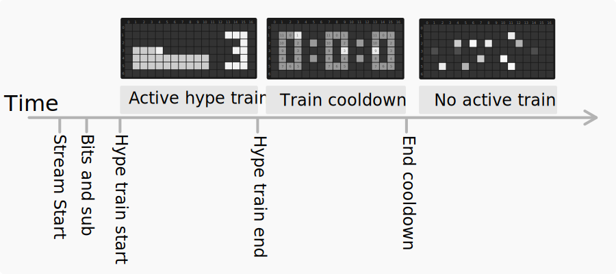
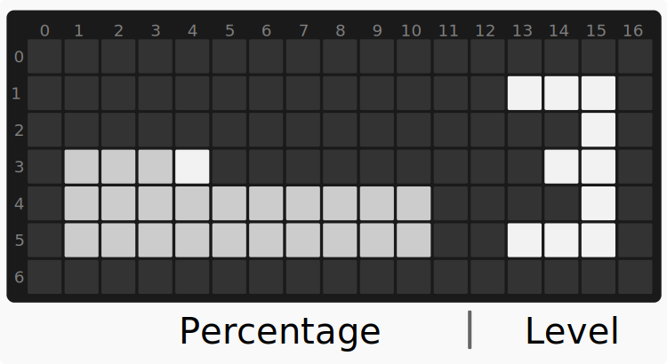
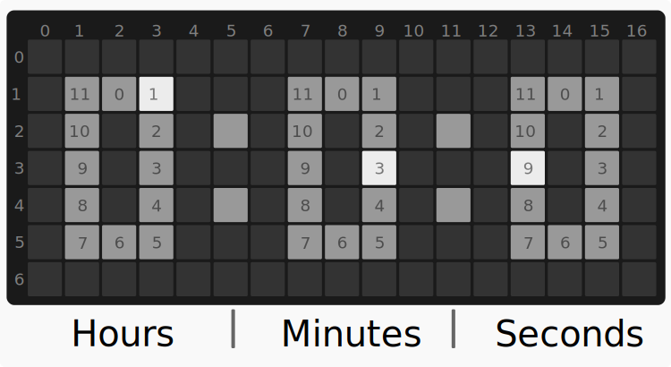
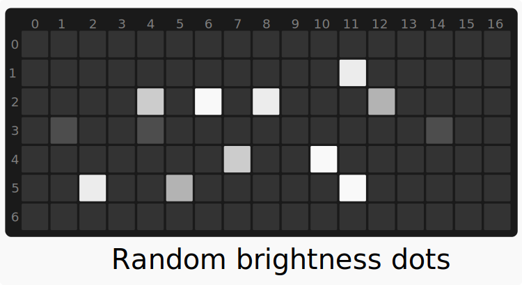

# Twitch Hype Train LED Effect
Twich hype train is:
>a super-sized celebration when community members unite to support a streamer they love. It challenges the community to reach epic levels of hype and rewards participants for keeping the train on track. [More info about hype train](https://help.twitch.tv/s/article/hype-train-guide?language=en_US)

This tool will connect a streamer hype train with raspberry pi zero and Scroll pHAT HD, the tool will show when the hype train start, its progress, cooldown countdown and when there is no hype train.

## How to use 
- Install  [Scroll pHAT HD library](https://github.com/pimoroni/scroll-phat-hd#manual-install)
- Rename `config.sample.py` to `config.py`
- Fill the missing value in `config.py`
- Run `python3 run.py`
- The display should show the status of the hype train

## How it work

The tool will use [Twich API](https://dev.twitch.tv/docs/api/) to check if the there is an active hype train for the selected user.

## Hype train stages

There are three hype train stages, the time for each stage change be change based on the user interaction or streamer setting.

### Active hype train

When the hype train starts the display will show the level of the hype train and the level percentage of the level.

The hype train levelstartsfrom 1 to 5, percentage increase can bechangedin hype train difficulty setting.

The active hype train timestartsat 5 minutes and reset to 5 minutes every time the train complete a level.

### Cooldown

After the hype train finish a cooldown will start, when the train in a cooldown state, the users can not trigger the
type train, streamer can  set the cooldown to be from 1 to 8 hours.

The watch above is based 12, it is based on this project [rectangle-scrollphathd-watch](https://github.com/plusmnt/rectangle-scrollphathd-watch), 
the only change is the watch will work backwards.

The tool will not make any server call in this stage since the hype train cannot be triggered until the cooldown end.

### No hype train

When the streamer are offline or thecooldownperiod end a random dot will appear in the display, thedotswill appear with random brightness value (0, 0.5).

## Config
| Vailable                | Description                                                                  | Default value           |
|-------------------------|------------------------------------------------------------------------------|-------------------------|
| client_id               | client_id from [Twitch API](https://dev.twitch.tv/console/apps/create)       | not empty               |
| client_secret           | client_secret from [Twitch API](https://dev.twitch.tv/console/apps/create)   | not empty               |
| grant_type              | grant type Must be `client_credentials`                                      | client_credentials      |
| scope                   | permissions the program requires                                             | channel:read:hype_train |
| username                | streamer username                                                            | not empty               |
| user_offline_wait_time  | time in seconds to wait between request if the user not streaming            | 60                      |
| online_user_wait_time   | time in seconds to wait between request if the user streaming                | 30                      |
| token_validate_interval | time in seconds  to check if the token is valid                              | 3600                    |
| max_skip_count          | maximum number of skipping when there is a problem before the program stop   | 5                       |
| skip_wait_time          | cooldown time in seconds before sending a new request when an error happens. | 5                       |

### Config note 
- If you are looking to test the hype train active display, you can get one of the usernames from streams with `hype train` tag e.g. [Hype train live stream](https://www.twitch.tv/directory/all/tags/c2839af5-f1d2-46c4-8edc-1d0bfbd85070)

## Hardware
* [Raspberry Pi Zero WH](https://www.adafruit.com/product/3708)
* [Pimoroni Scroll pHAT HD](https://www.adafruit.com/product/3473)

### Setup 
* [Raspberry Pi Zero Headless Quick Start](https://learn.adafruit.com/raspberry-pi-zero-creation)
* [Scroll pHAT HD installation](https://github.com/pimoroni/scroll-phat-hd#manual-install)

## Code
the code consists of 3 main files 
- `config.sample.py` : this contains all the configuration options and should be renamed to `config.py` before running.
- `helper.py`: this contains Twitch API functions and ScrollpHatHD display functions.
- `run.py`: this is the main file that use above two files to run, this file contains the logic of running the program.

## Future idea
It is possible to attach raspberry pi to a real toy train and make it run when the hype train active.
